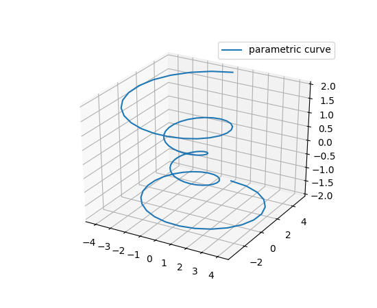
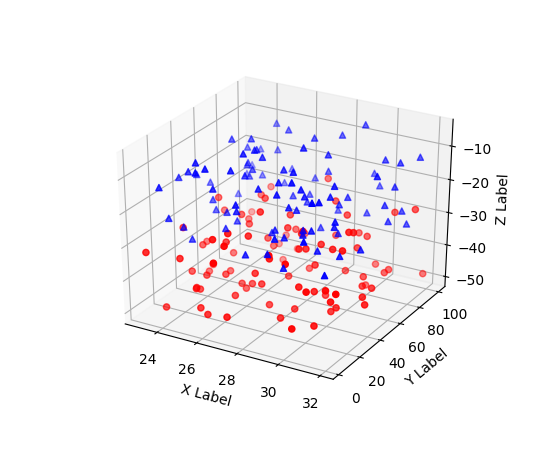
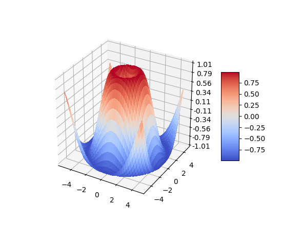
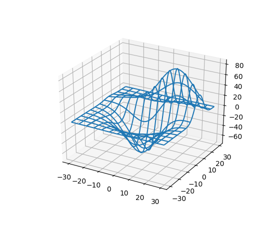

---
jupyter:
  jupytext:
    notebook_metadata_filter: all
    text_representation:
      extension: .md
      format_name: markdown
      format_version: '1.3'
      jupytext_version: 1.12.0
  kernelspec:
    display_name: Python 3
    language: python
    name: python3
  language_info:
    codemirror_mode:
      name: ipython
      version: 3
    file_extension: .py
    mimetype: text/x-python
    name: python
    nbconvert_exporter: python
    pygments_lexer: ipython3
    version: 3.9.7
  metadata:
    execution:
      allow_errors: true
  rise:
    enable_chalkboard: true
    height: 90%
    scroll: true
    width: 90%
---

Merci de **ne pas modifier** le nom de ce notebook (même pour y inclure son nom).

Quelques conseils:
- pour exécutez une cellule, cliquez sur le bouton *Exécuter* ci-dessus ou tapez **Shift+Enter**
- si l'exécution d'une cellule prend trop de temps, sélectionner dans le menu ci-dessus *Noyau/Interrompre*
- en cas de très gros plantage *Noyau/Redémarrer*
- **sauvegardez régulièrement vos réponses** en cliquant sur l'icone disquette ci-dessus à gauche, ou *Fichier/Créer une nouvelle sauvegarde*

----------------------------------------------------------------------------


# Séance 3 : fonctions à deux variables

<!-- #region slideshow={"slide_type": "slide"} -->
## Introduction

Dans ce cours, on s'intéresse aux tableaux à deux dimensions. Ils
peuvent représenter:

-   le résultat d'une fonction à deux variables

-   une image

-   une matrice

-   \...

Lorsqu'on utilise NumPy, il faut **éviter d'utiliser des boucles** !
**Faire directement les calculs sur des tableaux !**\
<!-- #endregion -->

<!-- #region slideshow={"slide_type": "slide"} -->
## Fonctions mathématiques à deux variables

On s'intéresse aux fonctions du type $z=f(x,y)$, par exemple

$$f(x,y) = x^2 + y^2$$

A 2 nombres en entrée correspond 1 nombre en sortie.

En python, la définition de cette fonction s'écrit:
<!-- #endregion -->

```python codeCellConfig={"lineNumbers": true} slideshow={"slide_type": "-"} tags=["raises-exception"]
def ma_fonction(x,y):
    return x*x + y*y
```

<!-- #region slideshow={"slide_type": "slide"} -->
Une des forces de Python réside dans la librairie `numpy`, qui permet
des calculs très efficaces sur des tableaux. Peut-on donner des tableaux
à `ma_fonction` ?

Oui si on utilise les fonctions mathématiques de `numpy`:
<!-- #endregion -->

```python codeCellConfig={"lineNumbers": true} slideshow={"slide_type": "-"} tags=["raises-exception"]
def ma_fonction(x,y):
    return np.sin(x*y)  # utiliser numpy
```

mais si `x` et `y` sont des tableaux 1D, alors le résultat sera 1D
aussi\...

```python codeCellConfig={"lineNumbers": true} slideshow={"slide_type": "-"} tags=["raises-exception"]
import numpy as np
ma_fonction(np.array([1,2,3]),np.array([4,5,6]))
```

La sortie de la fonction n'est pas le résultat de la fonction sur toutes
les paires $(x,y)$ de $\mathbb{R}^2$ (ou de
$\left[1,2,3\right]\times \left[4,5,6\right]$ dans l'exemple ci-dessus).

<!-- #region slideshow={"slide_type": "slide"} -->
## La fonction meshgrid
<!-- #endregion -->

```python codeCellConfig={"lineNumbers": true} slideshow={"slide_type": "-"} tags=["raises-exception"]
x = np.linspace(0, 2, 5)
y = np.linspace(0, 1, 3)
print("x =",x)
print("y =",y)
```

```python codeCellConfig={"lineNumbers": true} slideshow={"slide_type": "-"} tags=["raises-exception"]
ma_fonction(x,y)
```

L'exécution ne fonctionne pas car les tableaux `x` et `y` n'ont pas la
même taille. Il faut transformer les 2 listes 1D en 2 tableaux 2D
contenant toutes les paires de points possibles entre `x` et `y`.

<!-- #region slideshow={"slide_type": "slide"} -->
Ceci est réalisé par la fonction `numpy.meshgrid()`
<!-- #endregion -->

```python codeCellConfig={"lineNumbers": true} slideshow={"slide_type": "-"} tags=["raises-exception"]
xx, yy = np.meshgrid(x, y) 
print("xx =",xx)
print("yy =",yy)
```

Le résultat de `meshgrid` contient 2 grilles 2D des coordonnées `x` et
`y`.

<!-- #region slideshow={"slide_type": "slide"} -->
La fonction va s'appliquer à toutes les paires de points des tableaux 2D
`xx` et `yy` :
<!-- #endregion -->

```python codeCellConfig={"lineNumbers": true} slideshow={"slide_type": "-"} tags=["raises-exception"]
res = ma_fonction(xx,yy)
print(res)
```

Attention à l'ordre des indices :

```python codeCellConfig={"lineNumbers": true} slideshow={"slide_type": "-"} tags=["raises-exception"]
ma_fonction(x[3], y[1]) == res[1, 3]
```

<!-- #region slideshow={"slide_type": "slide"} -->
## Représentation graphique de tableaux 2D

Il existe plein de façon se représenter un tableau 2D, en particulier
par des surfaces 3D:
<https://matplotlib.org/mpl_toolkits/mplot3d/tutorial.html>










ou bien à l'aide d'échelles de couleurs.
<!-- #endregion -->

<!-- #region slideshow={"slide_type": "slide"} -->
## Surfaces 3D
<!-- #endregion -->

```python codeCellConfig={"lineNumbers": true} slideshow={"slide_type": "-"} tags=["raises-exception"]
# charge les librairies
import matplotlib.pyplot as plt
from mpl_toolkits.mplot3d import Axes3D #  3D
import numpy as np

# initialise les donnees
x = np.linspace(0,5,51)  
y = np.linspace(0,3,31)  
xx, yy = np.meshgrid(x,y)   
z = ma_fonction(xx,yy)

# trace le graphique
fig = plt.figure()
ax=plt.axes(projection='3d')  # permet la 3D
surf = ax.plot_surface(xx, yy, z)
# fixe les limites de l'axe z
ax.set_zlim(-1.01, 1.01)     
# titre de l'axe z 
ax.set_zlabel('ma fonction')
plt.show()
```

<!-- #region slideshow={"slide_type": "slide"} -->
## Lignes de niveaux (contours) 2D
<!-- #endregion -->

```python codeCellConfig={"lineNumbers": true} slideshow={"slide_type": "-"} tags=["raises-exception"]
# charge les librairies
import matplotlib.pyplot as plt
import numpy as np

# initialise les donnees
x = np.linspace(0,5,51)  
y = np.linspace(0,3,31)  
xx, yy = np.meshgrid(x,y)   
z = ma_fonction(xx,yy)

# trace le graphique
fig, ax = plt.subplots()
CS = ax.contour(xx, yy, z)
ax.clabel(CS, inline=1, fontsize=10)
ax.set_xlabel('x')
ax.set_ylabel('y')
plt.show()
```

Le nombre de niveaux ou directement les niveaux des contours peuvent
être préciser manuellement avec l'argument `levels`:

-   `ax.contour(xx, yy, z, levels=6)` impose d'avoir 6 contours;

-   `ax.contour(xx, yy, z, levels=[-1,0,1])` impose les contours
    $-1, 0,1$.

<!-- #region slideshow={"slide_type": "slide"} -->
## Carte colorée

`imshow` est adapté pour représenter des images ou des tableaux 2D.
<!-- #endregion -->

```python codeCellConfig={"lineNumbers": true} slideshow={"slide_type": "-"} tags=["raises-exception"]
# charge les librairies
import matplotlib.pyplot as plt
import numpy as np

# initialise les donnees
x = np.linspace(0,5,51)  
y = np.linspace(0,3,31)  
xx, yy = np.meshgrid(x,y)   
z = ma_fonction(xx,yy)

# trace le graphique
fig = plt.figure()
im = plt.imshow(z)
plt.xlabel('x')
plt.ylabel('y')
# creation barre de couleur
c = fig.colorbar(im) 
c.set_label('z')
plt.show()
```

On remarque deux problèmes:

1.  l'axe des $y$ est inversé par rapport au sens habituel;

2.  les axes sont numérotés en pixels et non avec les valeurs de $x$ et
    $y$.

<!-- #region slideshow={"slide_type": "slide"} -->
`imshow` est adapté pour représenter des images ou des tableaux 2D.
<!-- #endregion -->

```python codeCellConfig={"lineNumbers": true} slideshow={"slide_type": "-"} tags=["raises-exception"]
# charge les librairies
import matplotlib.pyplot as plt
import numpy as np

# initialise les donnees
x = np.linspace(0,5,51)  
y = np.linspace(0,3,31)  
xx, yy = np.meshgrid(x,y)   
z = ma_fonction(xx,yy)

# trace le graphique
fig = plt.figure()
im = plt.imshow(z, origin='lower', 
                 extent=[0,5,0,3])
plt.xlabel('x')
plt.ylabel('y')
c = fig.colorbar(im)
c.set_label('z')
plt.show()
```

Deux mots clés sont importants avec `imshow`:

1.  `origin=’lower’` permet de mettre l'origine 0 en bas;

2.  `extent` donne les valeurs min et max des axes $x$ et $y$ entre
    lesquelles numéroter les axes.

<!-- #region slideshow={"slide_type": "slide"} -->
`pcolor` est plus adapté pour représenter $z = f(x,y)$.
<!-- #endregion -->

```python codeCellConfig={"lineNumbers": true} slideshow={"slide_type": "-"} tags=["raises-exception"]
# charge les librairies
import matplotlib.pyplot as plt
import numpy as np

# initialise les donnees
x = np.linspace(0,5,51)  
y = np.linspace(0,3,31)  
xx, yy = np.meshgrid(x,y)   
z = ma_fonction(xx,yy)

# trace le graphique
fig = plt.figure()
im = plt.pcolor(x,y,z,shading='auto')
plt.xlabel('x')
plt.ylabel('y')
# creation barre de couleur
c = fig.colorbar(im) 
c.set_label('z')
plt.show()
```

<!-- #region slideshow={"slide_type": "slide"} -->
## Histogrammes 2D

L'objectif est de tracer un histogramme 2D de réalisations aléatoires de
points $(x,y)$.
<!-- #endregion -->

```python codeCellConfig={"lineNumbers": true} slideshow={"slide_type": "-"} tags=["raises-exception"]
# initialise les donnees
x = np.random.normal(size=50000)
y = x * 3 + np.random.normal(size=50000)

# trace le graphique
fig,ax = plt.subplots(1,4,figsize=(15,6))
ax[0].hist(x)
ax[1].plot(x,3*x,'o')
ax[2].plot(x,y,'o')
ax[3].hist2d(x, y, bins=(100, 100), cmap=plt.cm.jet)
ax[3].set_xlabel('x')
ax[3].set_ylabel('y')
plt.show()
```

<!-- #region slideshow={"slide_type": "slide"} -->
## À vos TPs !

1.  Ouvrir un terminal:

    -   soit sur https://jupyterhub.ijclab.in2p3.fr

    -   soit sur un ordinateur du 336

2.  Télécharger la séance d'aujourd'hui:

        methnum fetch L2/Seance3 TONGROUPE

    en remplaçant TONGROUPE par ton numéro de groupe.

3.  Sur un ordinateur du bâtiment 336 uniquement, lancer le jupyter:

        methnum jupyter notebook

4.  Pour soumettre la séance, dans le terminal taper:

        methnum submit L2/Seance3 TONGROUPE
<!-- #endregion -->

<!-- #region slideshow={"slide_type": "slide"} -->
Le cours est disponible en ligne ici :
<https://methnum.gitlab.dsi.universite-paris-saclay.fr/L2/>.

Rappel: votre gitlab personnel sert de sauvegarde pour passer vos
documents d'une plateforme à l'autre via les commandes methnum/fetch.


<!-- #endregion -->
